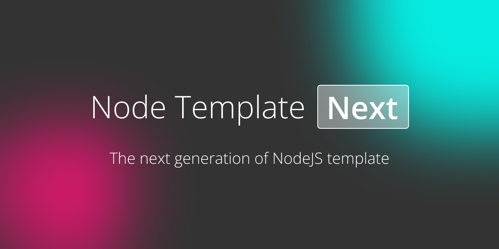

<div align="center">

  # node-template-next

  

</div>

## Features

- 🔥 Minimal [TypeScript](https://www.typescriptlang.org) based template for NodeJS
- ⚡️ Boost development with [esbuild](https://esbuild.github.io) + [swc](https://swc.rs) + [oxc](https://oxc-project.github.io)
- 🌍 Supports both ESM & CJS
- 🃏 Jest environment ready

## Getting Started

Press **Use this template** button on the top. That's it.


## Scripts

```bash
# Lint with `oxc`
yarn lint

# Run typescript based demo code with `swc`
yarn demo

# Run typescript based unit tests with `swc` + `jest`
yarn test

# Build with `esbuild`
yarn build

# Publish to npm
yarn release
```

## License

[MIT](./LICENSE)
